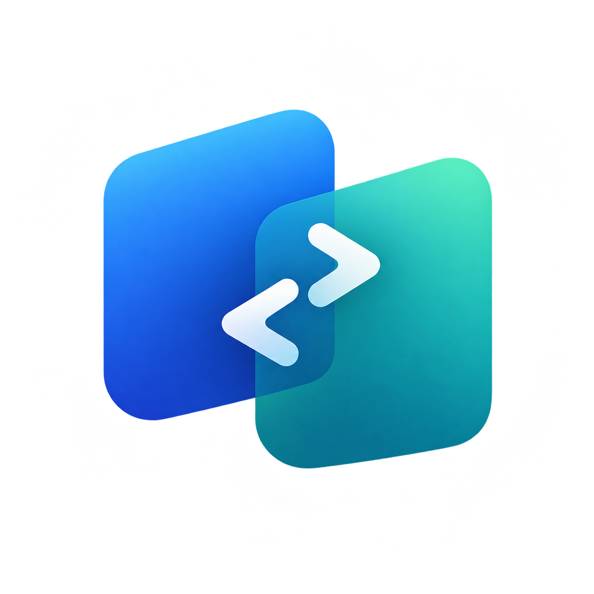
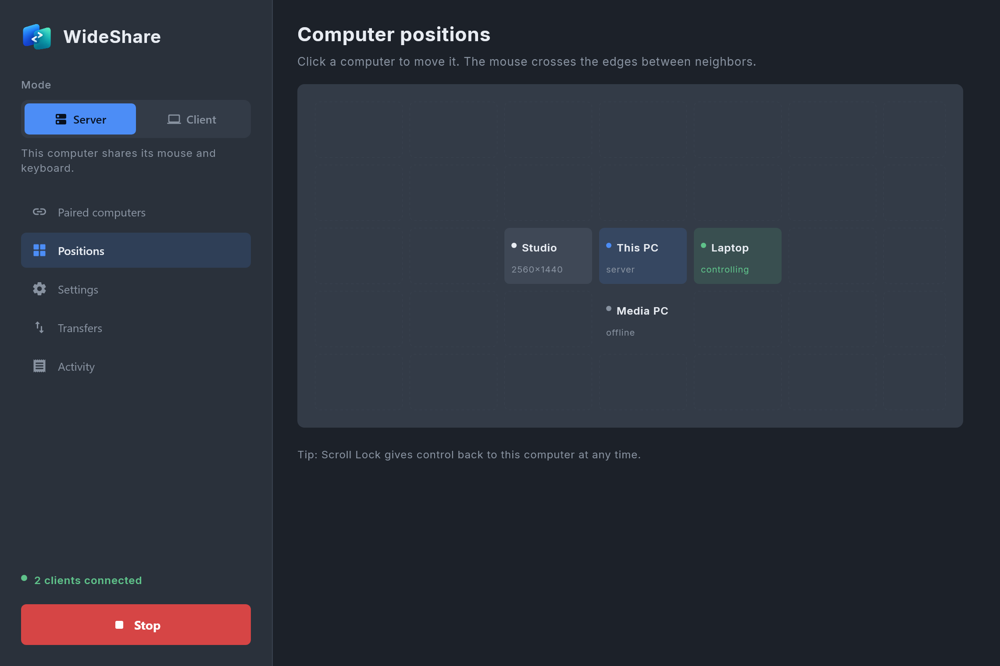
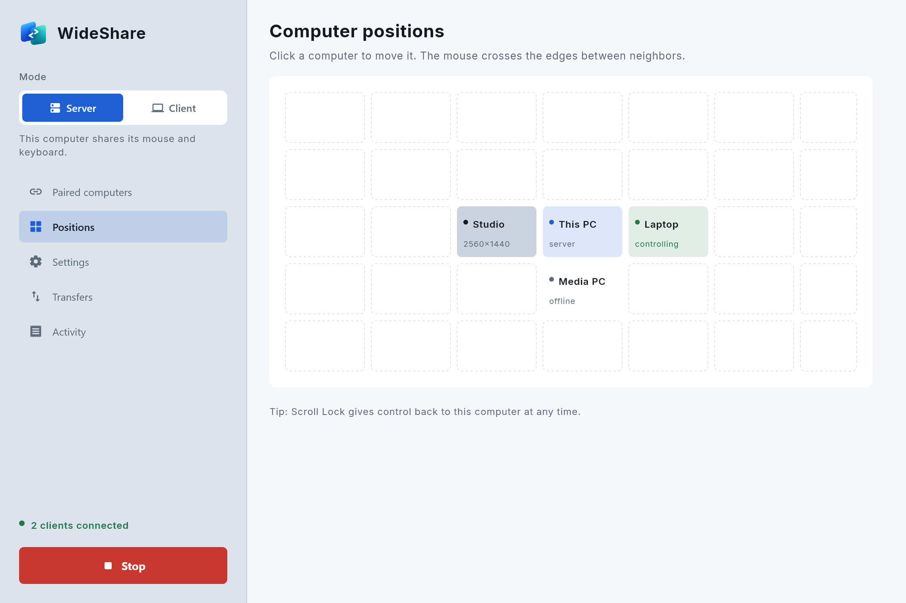
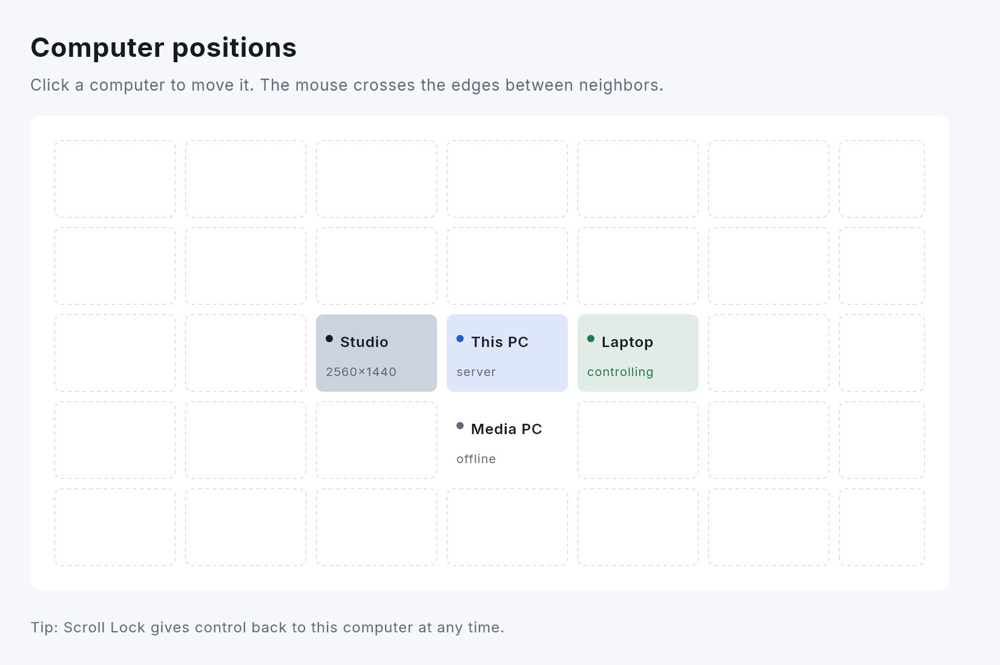
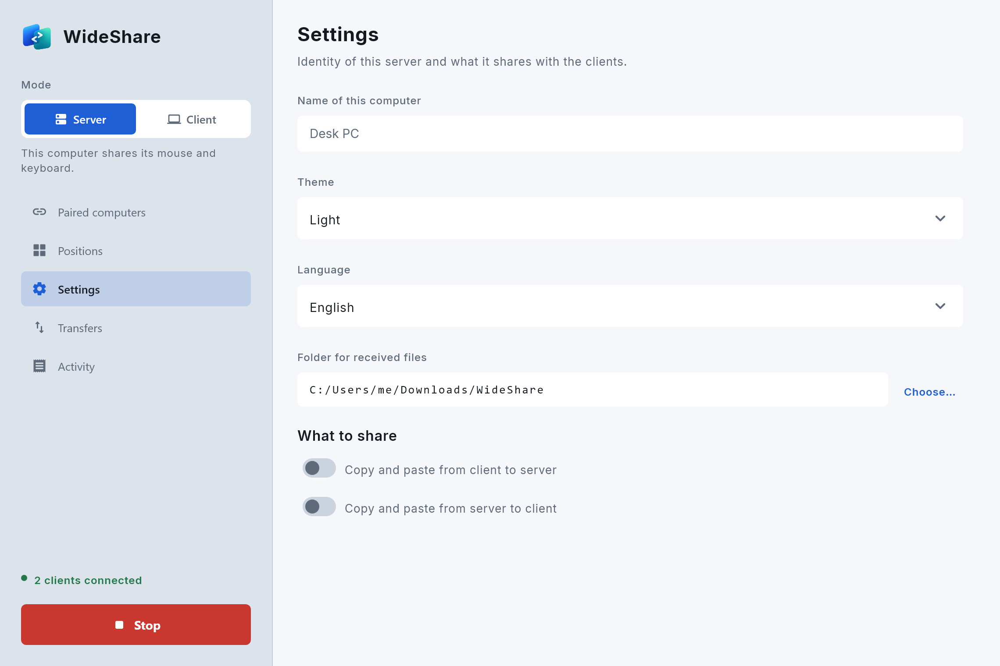
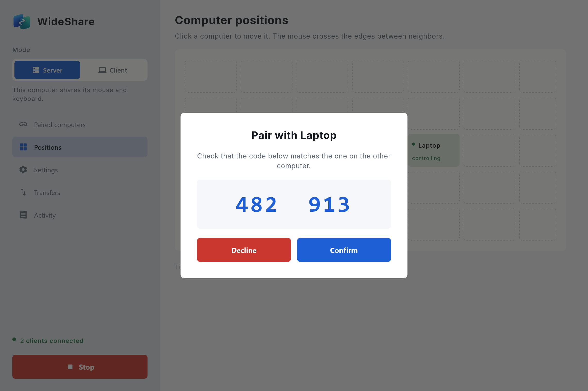
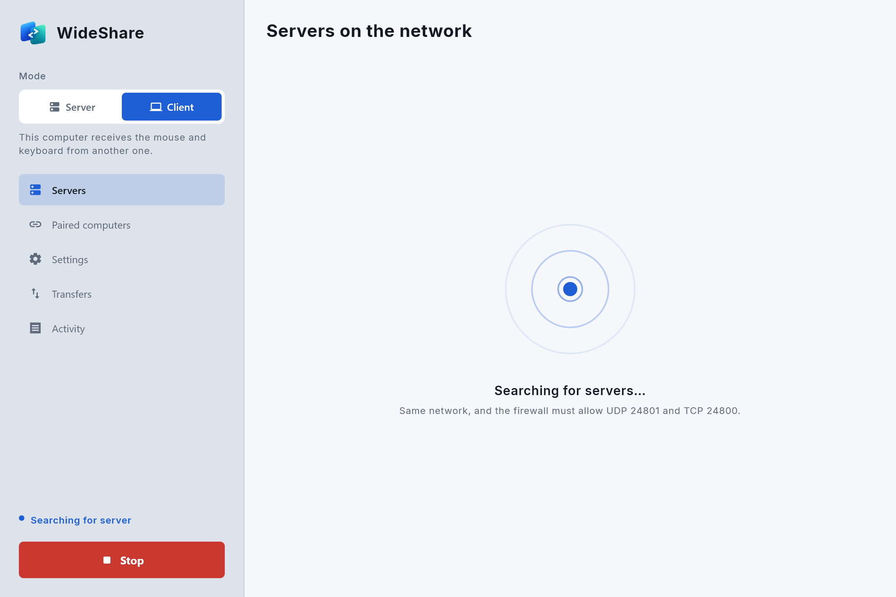

<p align="center">
  
</p>

<h1 align="center">WideShare</h1>

<p align="center">
  <b>Free and open source software that shares one mouse and keyboard across multiple computers (Windows and Linux).</b>
</p>

<p align="center">
  <a href="LICENSE"></a>
  
  
</p>

WideShare is **open source** software that lets you control several computers with a single mouse and keyboard. Move the cursor to the edge of the screen and it jumps to the machine next to it, with your clipboard, audio and files following along. Everything travels encrypted over your local network, with no cloud and no account.

## Screenshots

> Images live in [`docs/screenshots`](docs/screenshots).

| Dark theme | Light theme |
| --- | --- |
|  |  |

| Computer layout | Settings |
| --- | --- |
|  |  |

| Pairing | Searching for a server |
| --- | --- |
|  |  |

## Features

- **Shared mouse and keyboard**: the cursor crosses screen edges from one computer to the next.
- **Free-form layout**: place computers on a grid that matches your physical desk.
- **Shared clipboard**: copy text on one machine and paste it on another.
- **File transfer**: drag files from one computer to another, or copy and paste them; they arrive in the configured receive folder.
- **Audio sharing**: stream the sound of one computer to play on another.
- **Automatic discovery**: computers find each other on the local network and reconnect on their own.
- **Secure pairing**: each device is authorized once, and all traffic uses an encrypted, authenticated channel.
- **Cross-platform**: Windows and Linux (X11), as server or client.
- **Modern interface** built with Compose Desktop, with light, dark or automatic theme.
- **Three languages**: English, Portuguese and Spanish.

## Technologies

- [Kotlin](https://kotlinlang.org/) on JVM 17
- [Compose Multiplatform for Desktop](https://www.jetbrains.com/compose-multiplatform/) and Material 3 for the UI
- [Kotlin Coroutines](https://github.com/Kotlin/kotlinx.coroutines) for concurrency
- [JNA](https://github.com/java-native-access/jna) for native APIs: hooks, WASAPI and COM on Windows; Xlib and PulseAudio on Linux
- X25519, AES-GCM and HMAC from the Java platform for cryptography
- [Gradle](https://gradle.org/) for build and packaging (MSI and DEB)

## Project structure

```
src/main/kotlin/wideshare
├── core       # protocol, sessions, pairing, cryptography, clipboard and files
├── platform   # input and audio capture/injection (windows/ and linux/)
└── ui         # Compose screens
```

## Building and running

Requirements: JDK 17 or newer.

```bash
./gradlew run
```

Run the tests:

```bash
./gradlew test
```

Build the installers (MSI on Windows, DEB on Linux):

```bash
./gradlew packageDistributionForCurrentOS
```

## Contributing

Contributions are welcome: bug reports, ideas, translations and code.

1. Open an issue describing the problem or proposal.
2. Fork the repository and create a branch from `main`.
3. Follow the project conventions:
   - no file longer than 150 lines; split into files with a single responsibility each;
   - colors only through `Palette`, no loose `Color(...)` in components;
   - cards and buttons without borders, no gradients; red only for destructive actions.
4. Run `./gradlew test` before submitting.
5. Open a pull request explaining what changed and why.

## License

Distributed under the **GNU General Public License (GPL)**. You may use, study, modify and redistribute the software, as long as derivative works keep the same license. See the [LICENSE](LICENSE) file.
